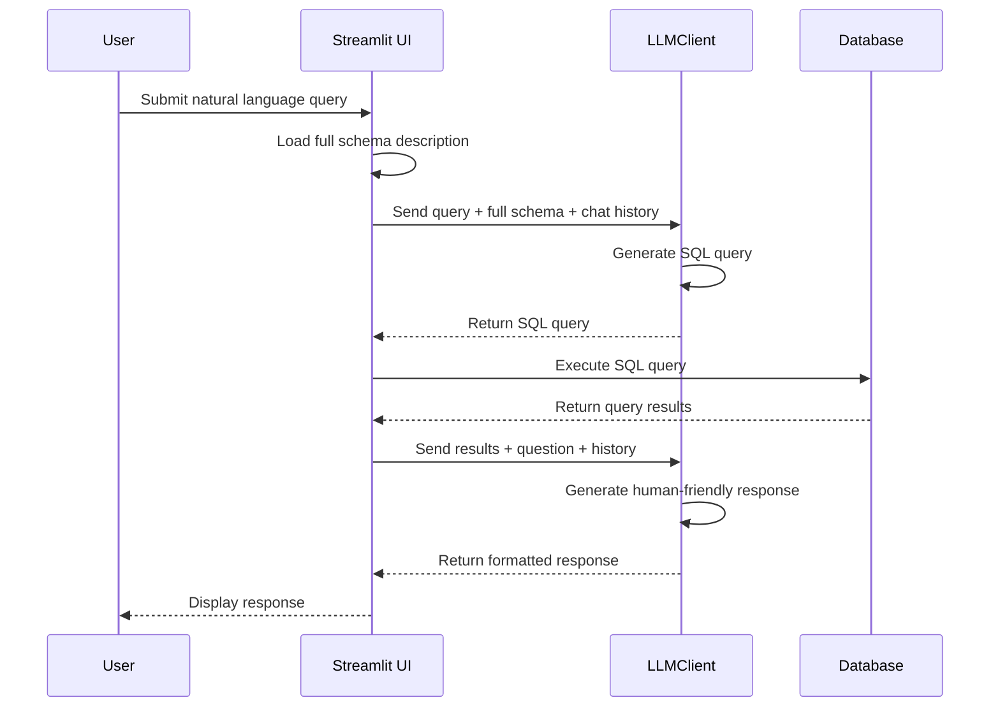
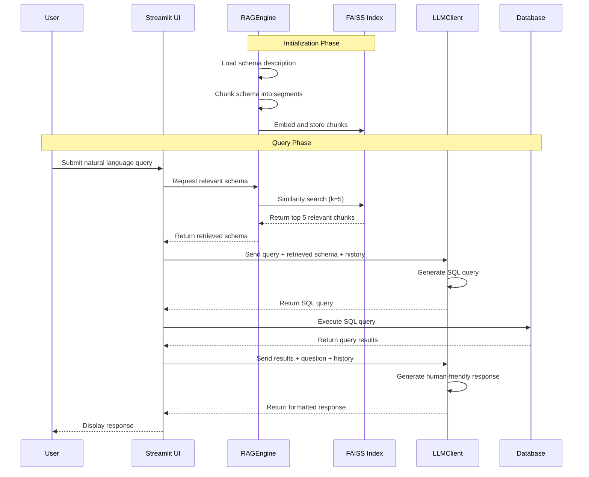

# Business Intelligence Chatbot with Langchain


This repo is for using LLMs to chat with your SQL database. Inspired by this [Gemini Chatbot repo](https://github.com/ardyadipta/gemini_chatbot_sql). Instead of using MySQL I used PostgreSQL and instead of using Google Gemini model series, I experimented using OpenAI (GPT-4.1 mini) and Anthropic (Claude Haiku 4.5) models which are cost-effective for production use.

## 🎯 Objective and Project Origin

Around February 2025, I was quite curious if there was a way where we can retrieve data in a database without having to write sql queries, but only using natural language. So initially I tried to search online and the first thing I found was using a library called PandasAI. But there are major limitations on the usage limits in using the API on the free tier and upgrading to another tier costs way too much (around 200 euro per month as of May 2025). So I need to find another way to do database chat but with a more manageable cost and full control over the platform's behavior. But I couldn't find it at that time.

On April, when I was starting to learn about Langchain Framework from the beginning in a more structured way, I learned about the document loader method that can upload content from csv (haven't learned about chunking, embedding, or retrieval at that time) and immediately tried a brute force approach by calling the OpenAI and Anthropic models to analyze the data, and it turns out that it can understand simple lookup questions, but when it comes to data aggregation the model messed up quite bad. That was really dumb experimentation actually but it kinda gives an idea of how the behavior and limitations of the model are when trying to understand tabular data that is being transformed into text.

One month later, I watched the [conference talk](https://youtu.be/wN3T5NCTSAY?t=16827) from Ardya Dipta (Head of Data Science Kalbe Group) at DevFest Jakarta 2024 and was quite interested in trying the approach explained in the demo. The main idea is that the output of the LLM will actually be the SQL query, and how the LLM understand the our database is not by storing all the data per row (like how I did before) because in reality company data have millions of rows and several hundred of columns in total so this will burn out all the token usage fast and the cost will definitely explode. So instead, we just feed it with our database schema information and the secret strategy here is that the schema information need to be as complete as possible like from the column descriptions, relationship to other table in the database, data expected behaviour and example values in a column, and so on.

And in this project we will try to implement that approach.

## 📁 Project Structure

The project has been refactored with a professional, modular structure:

```
Business Intelligence Chatbot with Langchain/
│
├── src/                               # Main application package
│   ├── __init__.py
│   │
│   ├── config/                        # Configuration and settings
│   │   ├── __init__.py
│   │   ├── settings.py                # App settings and environment variables
│   │   ├── models.py                  # LLM model initialization
│   │   └── prompts/                   # Prompt templates
│   │       ├── __init__.py
│   │       └── templates.py
│   │
│   ├── core/                          # Core business logic
│   │   ├── __init__.py
│   │   ├── database.py                # Database connection and queries
│   │   ├── llm_client.py              # LLM interaction handling
│   │   └── rag.py                     # RAG implementation for schema retrieval
│   │
│   ├── utils/                         # Utility scripts
│   │   ├── __init__.py
│   │   ├── database_setup_single_table.py
│   │   ├── database_setup_multiple_tables_olist.py
│   │   └── database_setup_multiple_tables_wrs.py
│   │
│   ├── db/                            # Database-related utilities
│   │   └── __init__.py
│   │
│   ├── faiss_index_store/             # Vector embeddings storage
│   │   ├── index.faiss
│   │   └── index.pkl
│   │
│   ├── app_single_basic.py            # Single table - Basic approach
│   ├── app_single_rag.py              # Single table - With RAG
│   ├── app_multi_basic.py             # Multiple tables - Basic approach
│   └── app_multi_rag.py               # Multiple tables - With RAG
│
├── datasets/
│   ├── dataset_single_table/          # Sales data CSV
│   └── dataset_multiple_tables/
│       ├── olist_db/                  # E-commerce datasets
│       │   ├── *.csv (9 tables)
│       │   ├── database_schema_description.doc
│       │   └── rag_test_questions.md
│       └── wrs_ehr_db/                # Healthcare EHR datasets
│           ├── *.csv (9 tables)
│           ├── ehr_database_docs.md
│           └── rag_test_questions.md
│
├── assets/                            # Project images and diagrams
├── pyproject.toml
├── requirements.txt
├── uv.lock
├── .env
└── README.md
```

### Application Variants

**Single Table Approach** - Sales data analysis:

- `app_single_basic.py`: Simple approach with full schema loaded
- `app_single_rag.py`: RAG-enhanced (minimal benefit for single table)

**Multiple Tables Approach** - E-commerce & Healthcare data analysis:

- `app_multi_basic.py`: Full schema loaded approach
- `app_multi_rag.py`: RAG-enhanced for better context retrieval (recommended)

Two database options available:

- **Olist DB**: Brazilian e-commerce dataset with 9 tables
- **WRS EHR DB**: Healthcare electronic health records with 9 tables

## 🚀 Features

- **Natural Language to SQL Conversion**: Convert plain English queries into SQL statements
- **RAG-Enhanced Architecture**: Uses retrieval-augmented generation to improve contextual understanding of database schema
- **Multi-Database Support**:
  - Olist e-commerce dataset (9 tables)
  - WRS EHR healthcare dataset (9 tables)
  - Single table sales analysis
- **Streamlit UI**: User-friendly interface for interacting with the database
- **Multiple LLM Support**: GPT-4.1 mini and Claude Haiku 4.5 (cost-effective models)
- **Detailed Response Generation**: Formats query results into natural, conversational responses
- **Conversational Memory**: Maintains chat history to support follow-up questions and contextual conversations
- **Clear Chat Functionality**: Easily reset conversations with a "Clear Chat History" button in the sidebar
- **Chat Interface**: Modern chat-style UI for a more natural conversation experience

## 🔧 Setup and Installation

### Prerequisites

- Python 3.12+
- PostgreSQL database
- OpenAI API key and/or Anthropic API key

### Installation

1. Clone this repository:

   ```bash
   git clone https://github.com/mcikalmerdeka/NLP-Learning.git
   cd "NLP-Learning/Business Intelligence Chatbot with Langchain"
   ```
2. Install dependencies:

   **Option A: Using uv (recommended)**

   Sync from pyproject.toml:

   ```bash
   uv sync
   ```

   Or install from requirements.txt:

   ```bash
   uv add -r requirements.txt
   ```

   **Option B: Using pip**

   ```bash
   pip install -e .
   ```

   Or from requirements.txt:

   ```bash
   pip install -r requirements.txt
   ```

   **Required dependencies** (from pyproject.toml):

   - faiss-cpu>=1.13.2
   - langchain>=1.2.3
   - langchain-anthropic>=1.3.1
   - langchain-community>=0.4.1
   - langchain-openai>=1.1.7
   - numpy>=2.4.1
   - openai>=2.15.0
   - pandas>=2.3.3
   - psycopg2>=2.9.11
   - python-dotenv>=1.2.1
   - streamlit>=1.52.2
3. Create a `.env` file in the project root with your API and database credentials:

   ```
   OPENAI_API_KEY=your_openai_api_key
   ANTHROPIC_API_KEY=your_anthropic_api_key
   DB_USER=your_database_username
   DB_PASSWORD=your_database_password
   DB_HOST=your_database_host
   DB_PORT=your_database_port
   ```
4. Set up the database:

   For single table approach:

   ```
   python src/utils/database_setup_single_table.py
   ```

   For multiple tables approach (Olist e-commerce):

   ```
   python src/utils/database_setup_multiple_tables_olist.py
   ```

   For multiple tables approach (WRS EHR healthcare):

   ```
   python src/utils/database_setup_multiple_tables_wrs.py
   ```

## 💻 Usage

### Single Table Approach

1. Launch the application:

   Basic version (recommended):

   ```
   streamlit run src/app_single_basic.py
   ```

   Or with RAG:

   ```
   streamlit run src/app_single_rag.py
   ```
2. Access the application at `http://localhost:8501`
3. Configure your database connection in the sidebar
4. Start asking questions in natural language about your sales data!

Example queries for sales data:

- "What were the total sales in 2003 and 2004?"
- "Show me the top 5 customers by revenue"
- "What is the phone number of customer name Toys of Finland, Co.?"
- "Which product line has the highest average order value?"
- "What about for 2005?" (follow-up question example)
- "Which of them had the highest growth?" (contextual follow-up)

### Multiple Tables Approach

1. Launch the application:

   Basic version:

   ```
   streamlit run src/app_multi_basic.py
   ```

   Or with RAG (recommended for multi-table):

   ```
   streamlit run src/app_multi_rag.py
   ```
2. Access the application at `http://localhost:8501`
3. Configure your database connection in the sidebar
4. Start asking questions in natural language!

**Example queries for Olist e-commerce data:**

- "What is the average monthly active user count for each year?"
- "Show me the number of customers who made more than one purchase (repeat orders) for each year!"
- "What are the top product categories by revenue per month?"
- "Displays detailed information on the amount of usage for each type of payment for each year!"
- "Which one showed the most significant increase?" (follow-up question)
- "Break down those results by customer location" (contextual follow-up)

**Example queries for WRS EHR healthcare data:**

- "How many patients were diagnosed with diabetes in 2024?"
- "What are the most common diagnoses across all facilities?"
- "Show me the average lab result values by diagnosis type"
- "Which providers have the highest patient appointment counts?"
- "What insurance plans are most frequently used?"

## ⚙️ How It Works

### Without RAG (Basic Approach)



**Flow:**

1. User submits a natural language query
2. Full database schema is loaded from file/configuration
3. LLM converts query to SQL using complete schema information
4. SQL query is executed against the database
5. Results are passed back to LLM for human-friendly response generation
6. Conversation context is maintained for follow-up questions

### With RAG (Enhanced Approach)



**Flow:**

1. **Initialization**: Database schema descriptions are embedded and stored in a FAISS vector index
2. User submits a natural language query
3. RAG engine retrieves only the most relevant schema chunks via similarity search
4. Context-enriched schema information is sent to LLM for SQL generation
5. Generated SQL is executed against the database
6. Results are formatted into natural language response
7. Chat history provides context for follow-up questions

**Key Difference**: RAG approach only sends relevant schema portions to the LLM, improving accuracy and reducing token usage for large schemas with multiple tables.

## 🔮 Future Improvements

- Support for more complex database schemas and relationships
- Integration with local models (Deepseek, Qwen, Llama)
- Advanced data visualization of query results
- Fine-tuning models for improved SQL generation accuracy
- Support for database operations beyond querying (inserts, updates)
- Enhanced conversation memory management
- User authentication and personalized query history
- Query result caching for improved performance

## 📧 Contact

For questions or feedback, please contact: mcikalmerdeka@gmail.com

## Project Screenshots

In this demo I used the multi-table approach with RAG implementation on the WRS EHR healthcare database. The screenshots showcase how the Business Intelligence Chatbot interacts with a complex database schema using natural language processing and SQL generation capabilities.

### Database Connect, Initial Question, and Context Retrieval


_The interface allows users to connect to their database and begin querying immediately. After establishing the connection, the system retrieves and processes the database schema information, allowing users to ask specific questions about the data in natural language without needing to write SQL queries manually._

### Query Generation and Model Response


_The AI assistant retrieves relevant schema context and automatically generates the appropriate SQL query based on the user's natural language question. The query is executed against the database, and results are returned in both raw format and a user-friendly interpretation. The LLM analyzes the query results and presents them with meaningful insights, transforming complex data into actionable business intelligence._

### Follow-up Question Capabilities


_The system implements conversational memory to maintain context between interactions, enabling natural follow-up questions. Users can ask for additional details, different breakdowns of the same data, or comparative analysis without repeating their original query context. This creates a more intuitive and efficient data exploration experience that mimics talking with a human data analyst._
